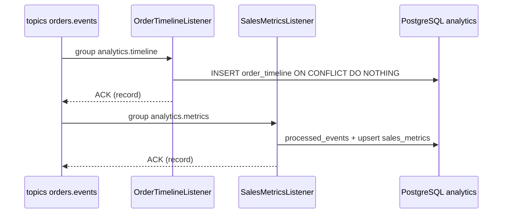
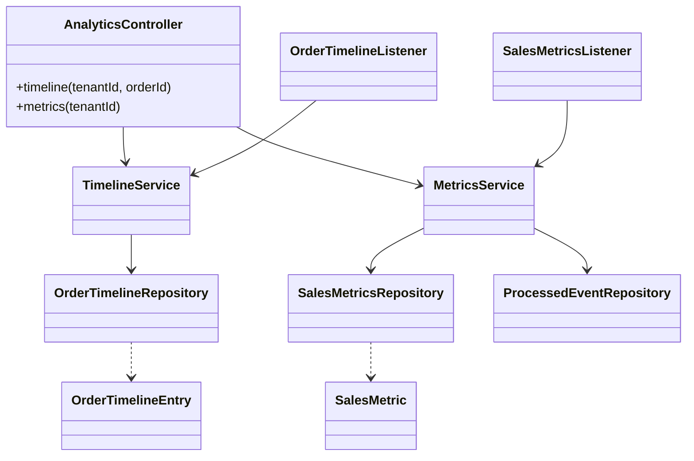

# UML 001 — Timeline y métricas

## Consumo

```mermaid
sequenceDiagram
  participant Kafka as topics orders.events
  participant TL as OrderTimelineListener
  participant ML as SalesMetricsListener
  participant DB as PostgreSQL analytics

  Kafka->>TL: group analytics.timeline
  TL->>DB: INSERT order_timeline ON CONFLICT DO NOTHING
  TL-->>Kafka: ACK (record)
  Kafka->>ML: group analytics.metrics
  ML->>DB: processed_events + upsert sales_metrics
  ML-->>Kafka: ACK (record)
```

## Estructura

```mermaid
classDiagram
  class AnalyticsController {
    +timeline(tenantId, orderId)
    +metrics(tenantId)
  }
  class TimelineService
  class MetricsService
  class OrderTimelineRepository
  class SalesMetricsRepository
  class ProcessedEventRepository
  class OrderTimelineEntry
  class SalesMetric
  class OrderTimelineListener
  class SalesMetricsListener

  AnalyticsController --> TimelineService
  AnalyticsController --> MetricsService
  TimelineService --> OrderTimelineRepository
  MetricsService --> SalesMetricsRepository
  MetricsService --> ProcessedEventRepository
  OrderTimelineListener --> TimelineService
  SalesMetricsListener --> MetricsService
  OrderTimelineRepository ..> OrderTimelineEntry
  SalesMetricsRepository ..> SalesMetric
```
